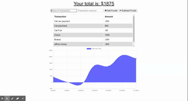

# Budget Tracker

https://safe-taiga-13179.herokuapp.com/

This is a web app that can be used online or offline to record transactions. It will record the name and amount of a transaction and whether to increment or decrement. The app then displays the summary of transactions and balance in a graph.

Technologies used:

- Javascript
- MongoDB
- NodeJS
- Express
- Mongoose
- Compression
- Heroku
- Morgan
- Mongo Atlas

#### License:

